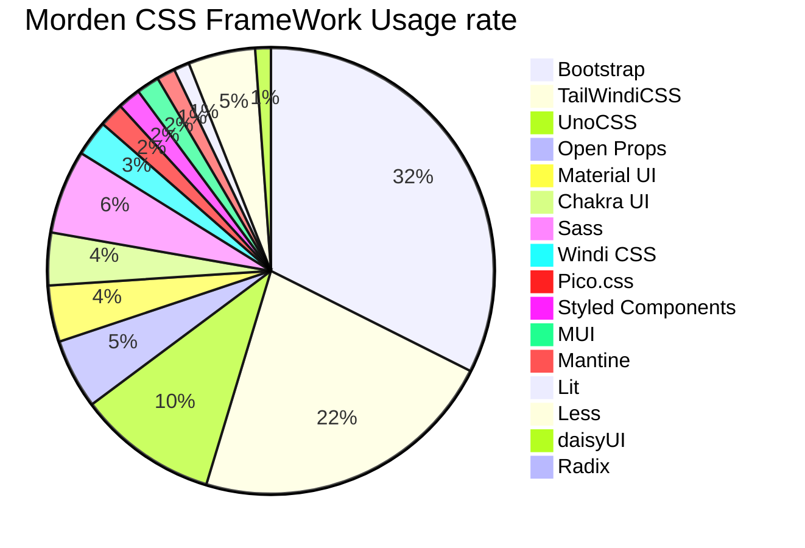
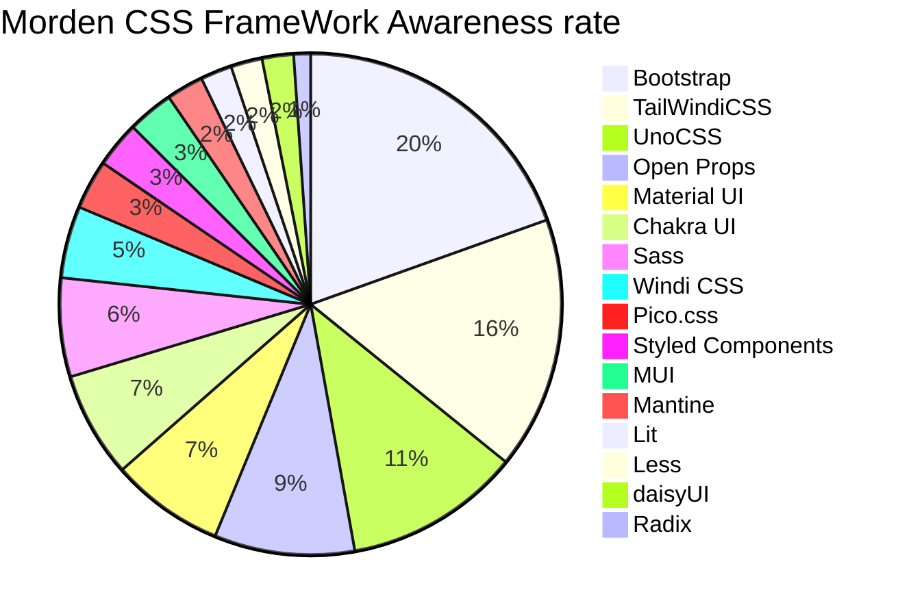

# UnoCSS 的探索和 OnuUI 的应用

🐧 现代原子化 CSS 最佳解决方案-UnoCSS

<div class="pt-12">
  <span @click="$slidev.nav.next" class="px-2 p-1 rounded cursor-pointer hover:bg-white hover:bg-opacity-10">
    Press Space for next page <carbon:arrow-right class="inline"/>
  </span>
</div>

<div class="absolute right-6 bottom-6 flex gap-2">
  <a href="https://github.com/yzh990918" target="_blank" alt="GitHub"
    class="text-xl slidev-icon-btn opacity-50 !border-none !hover:text-white">
    <carbon-logo-github />
  </a>
</div>

<!--
本次分享的主题是UnoCSS的探索和OnuUI的应用，UnoCSS是一款具有高性能且极具灵活性的即时原子化CSS引擎，OnuUI是基于UnoCSS和Vue3编写的UI组件库，本次分享将会从UnoCSS的设计理念、特性、生态、使用场景等方面进行介绍，同时也会介绍OnuUI的设计理念、搭建过程等方面，希望能够帮助大家更好的了解UnoCSS和OnuUI，也希望能够帮助大家更好的了解原子化CSS的设计理念和使用场景。
-->

---
preload: false
layout: presenter
presenterImage: https://avatars.githubusercontent.com/u/46418596?s=400&u=91acc437ca5781ddfa2b0bf7d416338a6eeca832&v=4
---

# Evan Yang

<div class="leading-8 opacity-80">

- Core team member of [OnuUI](https://github.com/onu-ui/onu-ui), [chatgpt-demo](https://github.com/ddiu8081/chatgpt-demo).<br>
- Creator of [magic-cli](https://github.com/vbs-plus/magic-cli), [za-zi](https://github.com/vbs-plus/zi), [json-tsc](https://github.com/vbs-plus/json-tsc).<br>
- Contributor of [UnoCSS](https://github.com/unocss/unocss), [vite-plugin-vue2](https://github.com/underfin/vite-plugin-vue2), [vue-element-admin](https://github.com/PanJiaChen/vue-element-admin), [vitesse-nuxt3](https://github.com/antfu/vitesse-nuxt3) and more.
</div>


<div class="my-10 grid grid-cols-[40px_1fr] w-min gap-y-4">
  <ri-github-line class="opacity-50"/>
  <div class="whitespace-nowrap"><a href="https://github.com/yzh990918" target="_blank">Evan-Yang</a></div>
  <ri-twitter-line class="opacity-50"/>
  <div><a href="https://twitter.com/zhihaoy18640576" target="_blank">Mohen</a></div>
  <ri-user-3-line class="opacity-50"/>
  <div class="whitespace-nowrap"><a href="https://evan-yang.top/" target="_blank">evan-yang.top</a></div>
</div>

---
layout: default
---

# What is Atomic CSS

Atomic CSS is the approach to CSS architecture that favors small, single-purpose classes with names based on visual function.

译文：原子化 CSS 是一种 CSS 的架构方式，它倾向于小巧且用途单一的 class，并且会以视觉效果进行命名。

<br/>

<div class="grid grid-cols-3 gap-8 pt-4 -mb-6"  
 v-if="$slidev.nav.currentPage === 3"
  v-motion
  :initial="{ x: 80 }"
  :enter="{ x: 0 }">
<a href="https://tailwindcss.com/" target="_blank" alt="GitHub"
    class="text-2xl slidev-icon-btn opacity-80 !border-none !hover:text-white">
    <logos:tailwindcss-icon/> Tailwind CSS
  </a>
  <a href="https://windicss.org/" target="_blank" alt="GitHub"
    class="text-2xl slidev-icon-btn opacity-80 !border-none !hover:text-white">
    <logos:windi-css/> Windi CSS
  </a>
   <a href="https://unocss.dev/" target="_blank" alt="GitHub"
    class="text-2xl slidev-icon-btn opacity-80 !border-none !hover:text-white">
    <simple-icons-unocss/> UnoCSS
  </a>
   <a href="https://open-props.style/#getting-started" target="_blank" alt="GitHub"
    class="text-2xl slidev-icon-btn opacity-80 !border-none !hover:text-white">
    <logos:processwire-icon/> Open Props
  </a>
   <a href="https://github.com/yzh990918" target="_blank" alt="GitHub"
    class="text-2xl slidev-icon-btn opacity-80 !border-none !hover:text-white">
    <logos:bootstrap/> Bootstrap Utilities
  </a>
   <a href="https://acss.io/" target="_blank" alt="GitHub"
    class="text-2xl slidev-icon-btn opacity-80 !border-none !hover:text-white">
    <logos:atomic-icon/> Atomizer CSS
  </a>
   <a href="https://primer.style/css/" target="_blank" alt="GitHub"
    class="text-2xl slidev-icon-btn opacity-80 !border-none !hover:text-white">
    <logos:github-copilot/> Primer CSS
  </a>
</div>


<!-- 首先来讲一下什么是原子化CSS，然后再看一下原子化CSS的生态

原子化CSS是一种将CSS样式拆分成最小的可复用的部分，然后通过组合这些部分来构建页面的技术，这种技术可以让我们更好的复用CSS样式，所以就有了 TailWindcss WindiCSS，UnoCSS 这种原子化 CSS 框架。

- Tailwind CSS：目前应用最广泛的原子化CSS框架，提供了大量的样式类，可以快速构建复杂的UI界面。
- Windi CSS： Tailwind CSS 的一种实现，提供了一些额外的特性，比如自动提取未使用的样式类(JIT)，支持CSS预处理器,支持属性模式等。
- UnoCSS: 后续会讲到
- Open Props: 基于 web design tokens 的原子化 CSS 框架，同样提供大量的工具类，轻量并且能在任意框架中快速集成。
- Bootstrap Utilities：Bootstrap框架的原子化CSS组件，提供了大量的工具类，可以快速地搭建出现代化的Web应用。

后面两个框架也是差不多，只不过是工具类各自定义的不同。
 -->

---
layout: default
---

# Why Atomic CSS?

<v-clicks>

- 📝 **不用想类名** - 相信很多人在编写样式类的时候经常会纠结类名，原子化提供的类名都是能够一眼就能知道大概意思又比直接编写style更加简洁
- 🎨 **无需离开您的HTML，即可快速建立现代网站** - 对于现在组件化开发的方式来说，单个组件文件相比以前一个html对应一个页面来说代码量要小很多，可能就几行html的组件代码，直接在html中编写样式是个更好的选择
- 📤 **强大的预设** - 利用原子化框架提供的预设原子类，极大地提高开发效率，将更多时间用在页面构造而不是重复地编写相似的代码
- 🧑‍💻 **IDE支持** - VS Code 的 Tailwind CSS 智能提示扩展涵盖了所有的类。在编辑器内既可得到智能的自动完成建议、提示及类定义等功能，而且无需配置。

</v-clicks>

<br>
<br>

<v-click>

Read more about [Why Atom CSS?](https://css-tricks.com/lets-define-exactly-atomic-css/)
</v-click>


---
layout: default
---

# How to use Atom CSS


<!-- 

https://transform.tools/css-to-tailwind 可以从这里举例子说明
 -->

---
preload: false
layout: presenter
presenterImage: >-
  https://cdn.staticaly.com/gh/yzh990918/static@master/20230417/image.5tfb1qk88igw.webp
---

# What is UnoCSS?

<div
  v-if="$slidev.nav.currentPage === 6"
  v-motion
  :initial="{ x: -80 }"
  :enter="{ x: 0 }">
  具有高性能且极具灵活性的即时原子化 CSS 引擎
</div>


<v-clicks>

- **完全自定义** - Uno 没有核心使用入口，所有功能都是通过预设提供 <a href="https://unocss.dev/guide/" class="!b-0" ><carbon-document text-teal-600 hover:text-teal-800/></a>
- **轻量且高性能** - Uno 没有解析，没有 AST，没有扫描，相较 WindiCSS/TailWindcss JIT快五倍，零依赖打包产物小于6kb <a href="https://antfu.me/posts/reimagine-atomic-css-zh#%E6%80%A7%E8%83%BD" class="!b-0"><carbon-document text-teal-600 hover:text-teal-800  /></a>
- **强大生态** - Uno 提供 Vite, Webpack, PostCSS, CLI, VSCode, Eslint, CDN 一键引入等支持 <a href="https://unocss.dev/integrations/vite" class="!b-0" ><carbon-document text-teal-600 hover:text-teal-800 /></a>
- **强大的语法配置** - Uno 支持配置 shortcuts, attributify mode, pure css icons, variant groups, CSS Directives 等 <a href="https://unocss.dev/config/" class="!b-0" ><carbon-document text-teal-600 hover:text-teal-800  /></a>
</v-clicks>

<br>

Read more about [UnoCSS](https://unocss.dev)

<!--
另外UnoCSS支持的Theme配置也是无比强大的，他继承了TailWindcss的theme配置，还扩展了更多的属性。

https://tailwindcss.com/

当然首先我想介绍一下原子化CSS是什么，原子化CSS是一种将CSS样式拆分成最小的可复用的部分，然后通过组合这些部分来构建页面的技术，这种技术可以让我们更好的复用CSS样式，所以就有了 TailWindcss WindiCSS 这种原子化 CSS 框架。但是 TailWindcss 在打包方面有着天然的弱电，打包的CSS提交较大，以至于即使使用 Vite ，加载和更新 CSS 成为了整个 Vite 应用的性能瓶颈，后面有了 WindiCSS。

Windicss 是一个类似 TailwindCSS 的工具，但是它是 JIT（类似于PNPM，esbuild的软链机制） 即时编译的，它不会像 TailwindCSS 一样将所有的 CSS 都打包到项目中，而是根据你的代码动态生成 CSS，这样就解决了 TailwindCSS 的打包问题，真正的按需加载，相较于 TailWindcss 要快 20~100 倍，但是 WindiCSS 也有着自己的问题，它的打包速度比较慢，而且它的配置也比较复杂，所以就有了 UnoCSS。
-->

---
layout: default
---

# Why UnoCSS?

<div
  v-if="$slidev.nav.currentPage === 7"
  v-motion
  :initial="{ x: -80 }"
  :enter="{ x: 0 }">
  UnoCSS 灵感来自于 <a href="https://antfu.me/">Anthony Fu</a> 对 <a href="https://windicss.org/">Windi CSS</a> 的大量维护工作，它完美继承了 <a href="https://windicss.org/">Windi CSS</a> 的按需加载，属性模式，快捷方式，变量组，编译模式等等特性，在此基础上做了大量的性能提升和打包优化，当然也是和 <a href="https://tailwindcss.com/">Tailwind CSS</a> 为基础搭建的，UnoCSS 在 TailWind 的基础上构建了一个自定义设计系统，你无需像在 TailWind 那样准守约定，用户可以自定义预设打到实现任何想要的功能。
</div>

<v-clicks>

UnoCSS提供的灵活性，让我们能够在它之上实践很多新功能：比如

- [Pure CSS icons 纯 CSS 图标](https://unocss.dev/presets/icons)
- [Attributify Mode](https://unocss.dev/presets/attributify)
- [Variant Groups](https://unocss.dev/transformers/variant-group)
- [Shortcuts](https://unocss.dev/config/shortcuts)
- [Tagify](https://unocss.dev/presets/tagify)
- [Web fonts](https://unocss.dev/presets/web-fonts)
- [CDN Runtime](https://unocss.dev/integrations/runtime)
- [Inspector](https://unocss.dev/tools/inspector)
</v-clicks>

<div class="absolute right-2 top-2 flex gap-2">
   <a href="https://unocss.dev" target="_blank" alt="GitHub"
    class="text-xl slidev-icon-btn opacity-50 !border-none !hover:text-white">
    <simple-icons-unocss />
  </a>
  <a href="https://unocss.dev/interactive/" target="_blank" alt="GitHub"
    class="text-xl slidev-icon-btn opacity-50 !border-none !hover:text-white">
    <carbon:align-box-middle-left />
  </a>
   <a href="https://unocss.dev/play/" target="_blank" alt="GitHub"
    class="text-xl slidev-icon-btn opacity-50 !border-none !hover:text-white">
    <carbon:eyedropper />
  </a>
   <a href="https://tailwindcss.com/docs/installation" target="_blank" alt="GitHub"
    class="text-xl slidev-icon-btn opacity-50 !border-none !hover:text-white">
    <simple-icons:tailwindcss/>
  </a>
</div>

<!--
UnoCSS还有对应的文档和Playground，你可以，并且生态插件很庞大，不管是VsCode代码提示插件还是各种自定的presets插件，都能满足大部分需求使用场景。当然平时用的时候忘记了一些css怎么写，或者在UnoCSS中怎么写，推荐查阅TailWindcss的官方文档，上面都能查到。

这里可以一个一个介绍功能点和实用性
-->

---
layout: default
---

# Morden CSS FrameWork Usage rate

<div class="grid-cols-3 pt-4 -mb-6 -ml-125 grid dark-hidden">



</div>
<v-click>
<div class="grid-cols-2 pt-4 -mb-6 -ml-125 hidden dark-grid">


</div>
</v-click>

<!--
下面来看看随着时间的推移，一些热门 CSS 框架的保留率、兴趣率、使用率和认知率。

使用率：（会再次使用+不会再次使用）/总计
认知率：（总计 - 从未听说过）/总计

从流行度来看 近两年TailWindcss类框架的增长趋势突飞猛进，几乎成为了前端开发者必备技能。
-->

---
layout: default
---

# Morden CSS FrameWork Awareness rate

<v-click>
<div class="grid-cols-3 pt-4 -mb-6 -ml-125 grid dark-hidden">

</div>

<div class="grid-cols-2 pt-4 -mb-6 -ml-125 hidden dark-grid">

```mermaid {theme: 'base', scale: 0.9,themeVariables: {primaryTextColor: '#fff'}}
pie title Morden CSS FrameWork Awareness rate
    "Bootstrap" : 27
    "TailWindiCSS" : 22.5
    "UnoCSS" : 15.7
    "Open Props" : 12.5
    "Material UI" : 10.1
    "Chakra UI" : 9.4
    "Sass" : 8.8
    "Windi CSS" : 6.4
    "Pico.css" : 4.4
    "Styled Components" : 4.1
    "MUI" : 4.1
    "Mantine" : 3.3
    "Lit" : 2.8
    "Less" : 2.8
    "daisyUI" : 2.8
    "Radix" : 1.5
```
</div>
</v-click>


---
layout: two-cols
---

# How to use UnoCSS

Vue + Vite Plugin
```ts {all|7|2-9|11-16|19|all}
// vite.config.ts
import UnoCSS from 'unocss/vite'
import { defineConfig } from 'vite'

export default defineConfig({
  plugins: [
    UnoCSS()
  ],
})

// uno.config.ts
import { defineConfig } from 'unocss'

export default defineConfig({
  // ...UnoCSS options
})

// main.ts
import 'virtual:uno.css'
```

::right::


<v-clicks>

CDN

```html
<script src="https://cdn.jsdelivr.net/npm/@unocss/runtime"></script>
```
</v-clicks>

<v-clicks>

Reset CSS CDN
```html
<link rel="stylesheet" href="https://cdn.jsdelivr.net/npm/@unocss/reset/normalize.min.css">
<!-- or -->
<link rel="stylesheet" href="https://cdn.jsdelivr.net/npm/@unocss/reset/tailwind.min.css">
```
</v-clicks>

<v-clicks>

<div class="absolute right-6 bottom-6">

 Read more about [UnoCSS Integrations](https://unocss.dev/integrations/vite)
</div>

</v-clicks>


<!--
几乎所有的框架都能使用UnoCSS，这里举一个例子，比如我们常用的Vue + Vite这种组合，引入方式如下：

1. 安装 UnoCSS
2. 在 Vite 入口文件引入插件
3. 根目录创建 uno.config.ts 文件，配置你的 unocss
4. 最后入口文件引入 uno.css 即可

另外还有一些其他的引入方式，比如 CDN，CDN的样式去除等等，获取更多的信息参考文档即可。
-->

---
layout: default
---
# What is OnuUI

OnuUI 是一个基于 Vue3 的 UnoCSS 组件库，允许您制作漂亮的 websites.它包括一个全面的预构建组件集合，这些组件可以开箱即用地在生产中使用。

组件库利用最新的技术栈 Vue3 Setup Script + Vite 4 搭建，全量使用 Typescript 编写，在打包和性能方面做了许多优化，是目前 UnoCSS 生态中为数不多的开源组件库。

- 🌈 **Components Design** - Onu provides neat & beautiful crafted UI components.
- 🔥 **On demand Import** - Provide resolver to automatically import only used components.
- 🎉 **Typescript Supported** - Support TypeScript & type checked & type inference.
- 💎 **Iconify Icons** - Use any icon from the library you love.
- 🍬 **CSS Preset** - Has UnoCSS preset package to use, rendered UI easily.
- ⚙️ **Theme Config** - Use attribute mode like unocss to design. Support theme config to customize theme.


<div class="absolute right-3 -bottom-20 flex gap-2">
  <a href="https://github.com/onu-ui/onu-ui" target="_blank" alt="GitHub"
    class="text-xl slidev-icon-btn opacity-50 !border-none !hover:text-white">
    <carbon-logo-github />
  </a>
   <a href="https://onu.zyob.top/" target="_blank" alt="GitHub"
    class="text-xl slidev-icon-btn opacity-50 !border-none !hover:text-white">
    <carbon-document />
  </a>
   <a href="https://onu.zyob.top/play/" target="_blank" alt="GitHub"
    class="text-xl slidev-icon-btn opacity-50 !border-none !hover:text-white">
    <carbon:rocket />
  </a>
</div>

<!-- 这里演示演示onuui -->

---
layout: default
---

# How to Start a UI Design System

<v-click>

搭建组件库必备的过程：
</v-click>

<v-clicks>

- 开发环境，你得起个服务去调试代码
- 支持按需引入，应该没有人愿意全量导入组件库
- 组件库编译，生成 umd 和 esm 模块的组件代码,类型提示文件等等
- 构建开发文档，至少得有个中文文档说明一下组件怎么用
- 单元测试，你写的代码得信的过
- 桌面端和移动端的组件预览，你得让使用者看到组件具体长什么样子
- 代码格式化和规范检测工具，毕竟是团队作案，没有规矩不成方圆
- 自动化的文档部署和测试流程，总不能每次发布版本都手动去部署文档和测试
</v-clicks>


<!-- 首先我想聊一聊组件库搭建的这个话题，我大概总结了一下搭建的几个要点 -->

---
layout: default
---
# How is OnuUI implemented?

<v-clicks>

- 开发环境： Monorepo + Pnpm workspaces + Vue3 + Vite4 + UnoCSS + Typescript
- 打包方面：Vite + Tsup + Esbuild + Vue-tsc
- 代码校验方面：simple-git-hook + lint-staged + eslint + eslint-config
- 组件库playground：借鉴 Vue 官方 playground，利用 @vue/repl 和依赖的 CDN 搭建
- 单元测试：Vitest + @vue/test-utils 组件测试细节，测试报告，覆盖率等等
- 文档服务：Vitepress + netlify + Vitepress Code Block plugin.
- CI，CD：Github Action + changelogithub
- 工具方面：esno + rimraf + unplugin-auto-imports + unplugin-vue-components + vite-plugin-vue-setup-extend
</v-clicks>


<v-clicks>

编写一个组件的全流程

提 Feture Request => 讨论同意 => 原型设计 => 组件功能和配置确定 => 按照 Contrubiting md 开发 => 单元测试 => 编写文档 => 提 MR => MR Request => 发版本
</v-clicks>


<!-- 
1. 首先采用的是 Monorepo 类型架构工程，方便子包发布和管理，然后用的包管理工具是Pnpm
2. 写代码方面是纯 Typescript + UnoCSS + Vue3 setup 或者 TSX 编写
3. 打包方面：Vite 打包兼容esm和cjs的组件包，底层是esbuild，很方便，开发环境调试也方便，vite build--watch 可以 HMR Build，Tsup 对 Unocss 样式文件和类型声明，对utils打包，Vue-tsc打包组件dts，配合 Volar 打包组件 global dts 等等
4. 代码校验方面：simple-git-hook + lint-staged + eslint + eslint-config 进行代码校验和修复
5. 组件库playground：借鉴 Vue 官方playground，利用 @vue/repl 和依赖的 CDN 搭建
6. 单元测试：Vitest + @vue/test-utils 组件测试细节，测试报告，覆盖率等等
7. 文档服务：Vitepress + netlify + 自己开发的组件代码预览查看插件(基于Vitepress plugin写的)
8. CI，CD：利用 Github Action，在 Merge Request 或者 Main 分支 代码提交时，进行单元测试和lint校验；本地使用 pnpm 组合打包命令，本地走一遍CI命令，build + test + bumpp 更新子包版本，发布代码 main 收到 git tags上v标识，利用 changelogithub 解析 本次发布设计commit，改写 release 日志， 然后自动进行装依赖，单测，构建发布到 npm
9. 工具方面：UnoCSS全家桶，esno跑ts脚本,rimraf 构建前清包，unplugin-auto-imports 自动解析API声明，unplugin-vue-components 自动注册Vue组件，vite-plugin-vue-setup-extend 设置setup script component name，还有一些辅助Node插件，和 Vite 打包插件

提 Feture Request => 讨论同意 => 原型设计 => 组件功能和配置确定 => 按照 Contrubiting md ，开发 => 单元测试 => 编写文档 => 提 MR => MR Request => 发版本
 -->

---
layout: two-cols
---

# How to use OnuUI

Full Import

```bash
pnpm add onu-ui && pnpm add -D unocss
```

```ts
// main.ts
import OnuUI from 'onu-ui'
import 'uno.css'
import 'onu-ui/dist/style.css'

createApp(App).use(OnuUI).mount('#app')
```

```json
// Get Volar Support tsconfig.json
{
  "compilerOptions": {
    // ...
    "types": ["onu-ui/volar"]
  }
}

```

::right::

<v-clicks>

On-demand Import

```bash
pnpm add -D unplugin-vue-components unplugin-auto-import
```

</v-clicks>

<v-clicks>

```ts
// vite.config.ts
import { defineConfig } from 'vite'
import AutoImport from 'unplugin-auto-import/vite'
import Components from 'unplugin-vue-components/vite'
import { OnuResolver } from 'onu-ui'

export default defineConfig({
  // ...
  plugins: [
    // ...
    AutoImport({
      resolvers: [OnuResolver()],
    }),
    Components({
      resolvers: [OnuResolver()],
    }),
  ],
})
```
</v-clicks>

<v-clicks>

<div class="absolute right-1 bottom-1">

 Read more about [OnuUI Document](https://onu.zyob.top/)
</div>

</v-clicks>


<!--
按需加载 完全导入，获取TS支持
-->

---
layout: default
---

# Awesome UnoCSS

**🏖️ Community presets**

- [Community presets](https://unocss.dev/presets/community#community-presets): A collection of community-made presets for UnoCSS

**🌈 Community frameworks**

- [Community frameworks](https://unocss.dev/presets/community#community-frameworks): A collection of community-made UI frameworks for UnoCSS

**🏝️ Awesome Projects**

- [ChatGPT-demo](https://github.com/anse-app/chatgpt-demo): Minimal UI for ChatGPT, Powered by unocss + solid + astro + ssr + openAI
- [Anse-app](https://github.com/anse-app/anse): Supercharged experience for ChatGPT, Powered by unocss + solid + astro + ssr + openAI
- [UnoCSS Animates](https://github.com/zyyv/unocss-animates): Preview all animations in UnoCSS.


<div class="absolute right-1 bottom-5">

 Learn more about [UnoCSS Document](https://unocss.dev/)
</div>

---
class: grid text-center align-self-center justify-self-center
---

# Speak freely

聊聊最近学的新的技术或者看过的最新的技术等等

<!--

- Vercel storage/solid-js/ https://mp.weixin.qq.com/s/UDv4loT8iaTgkeFjeq-T-w
- RSC - a collection of online databases 
- RSPack
- https://github.com/tauri-apps/tauri

https://github.com/yzh990918?tab=stars
-->
